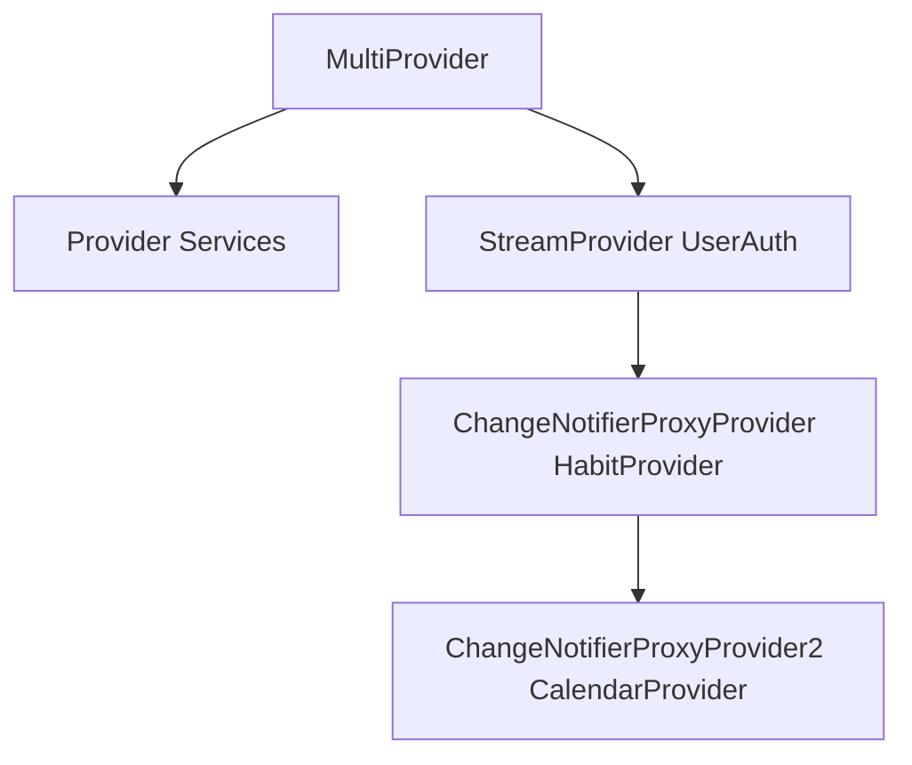

# TH5 — Habit Tracker (Flutter + Firebase)

Ứng dụng theo dõi thói quen hàng ngày theo **tuần** hoặc **cách ngày**, xây dựng theo kiến trúc **MVVM** (Model–View–ViewModel) với **Provider** làm state management.

---

## 📁 Cấu trúc thư mục

```
lib/
├── main.dart                    ← Entry point, khởi tạo Firebase & MultiProvider
├── firebase_options.dart        ← Cấu hình Firebase (API keys)
│
├── models/                      ← Lớp dữ liệu (Data Layer)
│   ├── habit_model.dart         ← Dữ liệu thói quen cá nhân
│   └── habit_log_model.dart     ← Dữ liệu lịch sử hoàn thành
│
├── services/                    ← Lớp xử lý dữ liệu ngoại vi (Service Layer)
│   ├── auth_service.dart        ← Xác thực Firebase Auth
│   ├── local_storage_service.dart ← SharedPreferences (offline fallback cache)
│   ├── firestore_service.dart   ← Cloud Firestore (online sync)
│   └── connectivity_service.dart ← Kiểm tra trạng thái mạng
│
└── providers/                   ← Lớp logic & quản lý trạng thái (ViewModel)
    ├── habit_provider.dart      ← CRUD thói quen + lọc + lấy dữ liệu Cloud
    └── calendar_provider.dart   ← Logic lịch Ngày/Tuần/Tháng + theo dõi tiến độ
```

---

## 📦 Models — Mô tả chi tiết

### `habit_model.dart` — Cấu hình thói quen

| Trường | Kiểu | Mô tả |
|--------|------|-------|
| `id` | `String` | ID duy nhất định danh (UUID) |
| `userId` | `String?` | Thuộc về User nào (AuthService) |
| `title` | `String` | Tên thói quen (VD: "Uống nước") |
| `detail` | `String` | Mô tả chi tiết |
| `type` | `HabitType` | `weekly` (theo tuần) hoặc `interval` (cách ngày) |
| `weeklyDays` | `List<int>?` | Ngày trong tuần: `[1,3,5]` = Thứ 2, 4, 6 |
| `intervalDays` | `int?` | Số ngày cách quãng (VD: 2 = cách 1 ngày) |
| `startDate` | `DateTime` | Ngày bắt đầu tính chu kỳ |
| `timesPerDay` | `int` | Số lần thực hiện/ngày (VD: uống nước 8 lần) |
| `lastCompleted` | `DateTime?` | Lần gần nhất hoàn thành (local backup) |
| `category` | `String` | Nhãn phân loại: "Sức khỏe", "Học tập",... |
| `isDeleted` | `bool` | Soft-delete: `true` = ẩn khỏi UI nhưng giữ dữ liệu lịch sử |

**Phương thức quan trọng:**
- `toJson()` / `fromJson()` — Chuyển đổi JSON
- `isDueOn(DateTime date)` — Kiểm tra thói quen có cần thực hiện vào ngày `date` không (timezone-safe)

### `habit_log_model.dart` — Kết quả thực hiện

Lưu **trạng thái hoàn thành** lên **Firestore** (cloud).

| Trường | Kiểu | Mô tả |
|--------|------|-------|
| `id` | `String?` | ID document trên Firestore |
| `habitId` | `String` | Liên kết với `Habit.id` |
| `userId` | `String` | ID người dùng |
| `date` | `String` | Ngày thực hiện, định dạng `YYYY-MM-DD` |
| `isCompleted` | `bool` | `true` khi đạt đủ `timesPerDay` |
| `count` | `int` | Số lần đã bấm hoàn thành (VD: 2/3) |

---

## 🔧 Services — Mô tả chi tiết

### `auth_service.dart` — Xác thực người dùng
Cung cấp Stream `authStateChanges` quan trọng dùng bọc ngoài cùng ứng dụng làm Proxy. Cung cấp các thao tác ẩn danh, SignIn/SignOut.

### `local_storage_service.dart` — Lưu trữ offline
Lưu list JSON thói quen xuống `SharedPreferences` làm local fallback cache dự phòng. 

### `firestore_service.dart` — Cloud Firestore
Hoạt động cực kỳ mạnh mẽ kết hợp Offline Persistence của Firebase SDK (Tự lưu Disk Cache nếu thiết bị mất Internet).

| Phương thức | Mô tả |
|-------------|-------|
| `syncHabit(...)` | Lưu/Đồng bộ trực tiếp Model thói quen lên Cloud (Collection `habits`) |
| `getHabits(userId)` | Fetch danh sách thói quen thuộc về User |
| `syncLog(HabitLog)` | Đẩy/cập nhật 1 log ngày (composite key: `userId_habitId_date`) |
| `getLogsForDate(...)` | Query log hoàn thành theo 1 ngày |
| `getLogsForWeek(...)` | Query logs tính trên 1 tuần |
| `getLogsForMonth(...)`| Query logs tính trên 1 tháng |

---

## 🧠 Providers — Kiến trúc Proxy Liên thông Cấp

### `habit_provider.dart` — Quản lý danh sách thói quen
Được điều khiển tự động bởi **ProxyProvider**. Bất cứ khi nào **Auth thay đổi**, provider sẽ tự nhận `userId`, tự hook lên Firebase để mix dữ liệu Online về bộ nhớ nội bộ.

| API | Mô tả |
|-----|-------|
| `activeHabits` | Danh sách thói quen sẵn có, loại trừ soft delete |
| `isLoading` | Trạng thái đang tải từ Firebase |
| `addHabit(...)` | Push habit lên Offline + Cloud Firebase |
| `updateHabit(...)`| Cập nhật thói quen cho User |
| `deleteHabit(id)` | Xóa mềm, bảo vệ log lịch sử |
| `getHabitsForDate`| Lọc theo chu kỳ (Ngày Due) |

### `calendar_provider.dart` — Logic lịch & hoàn thành
Được tự động bơm UserContext và HabitList mỗi giây. Tối giản hóa bộ tham số điều khiển giao diện.

| API | Mô tả |
|-----|-------|
| `selectedDate` | Ngày đang được trỏ vào |
| `currentView` | Chế độ Grid: `day`, `week`, `month` |
| `habitsForToday` | Danh sách việc cần làm (Chỉ hiện Habit trùng lặp ngày này) |
| `completionCount`| `Map<habitId, count>` — đếm số lần hoàn thành của Habit trong ngày |
| `periodLogs` | Dữ liệu render ra những chấm xanh/đỏ cho Grid Lịch biểu Tháng |
| `selectDate(date)` | User bấm vô 1 ngày Lịch → Auto load list Habit & Load Log Firestore của ngày đó |
| `changeView(view)` | Chuyển Tab/Chế độ ngày-tháng |
| `fetchLogsForView` | Yêu cầu lấy chùm dữ liệu Log cả Tuần/Tháng gửi về cho Lưới Lịch (Grid) |
| `toggleCompletion` | Tick hoàn thành Habit → Trực tiếp kích hoạt Offline Queue cho Firestore |

---

## 🔄 Luồng hoạt động chính

### 1. Khởi động ứng dụng
Thiết lập chuỗi Dependency Injection vững chãi có gắn kèm Auto Lifecycle:

`HabitProvider` và `CalendarProvider` tự động theo rình thay đổi Account của User để rải nội dung.

### 2. Hành động Tick Hoàn thành Việc Lặp
```
UI (Lịch) ──> CalendarProvider.toggleCompletion(habitId, date, timesPerDay)
                  │
                  ├─ Cập nhật bộ State tức thì làm cho giao diện siêu phân hồi 
                  └─ FirestoreService.syncLog(log)
```
> [!NOTE] 
> *Bạn không cần quan tâm đến lỗi kết nối mạng.* FirebaseSDK sẽ ném log vào máy điện thoại, đợi khi nào wifi có vạch sóng thì ngầm đồng bộ lên Cloud.

---

## 🎨 Hướng dẫn Code Giao diện (User Interface)

### Cách lấy List ra màn hình
```dart
// Gọi danh sách thói quen cho UI Settings
final habits = context.watch<HabitProvider>().activeHabits;

// Gọi danh sách việc phải làm "hôm nay/tại selectedDate" 
final tasks = context.watch<CalendarProvider>().habitsForToday;
```

### Tick Checkbox
Điểm khác biệt của phiên bản MVVM ProxyProvider là bạn không cần phải chạy ra ngoài lấy User ID cực khổ. Chỉ việc trỏ hàm:
```dart
Checkbox(
  value: count >= habit.timesPerDay,
  onChanged: (_) {
    // Đơn giản, sạch sẽ, Provider đã tự lưu context User.
    context.read<CalendarProvider>().toggleCompletion(
      habit.id,
      calendarProvider.selectedDate,
      habit.timesPerDay,
    );
  },
)
```

### Bấm Sang Ngày Khác
```dart
// Bấm trên Appbar Calendar
context.read<CalendarProvider>().selectDate(DateTime(2026, 4, 1));
```
```dart
// Bấm chuyển Lịch từ Tuần thành Lịch Tháng
context.read<CalendarProvider>().changeView(CalendarView.month);
context.read<CalendarProvider>().fetchLogsForView(DateTime(2026, 4, 1));
```
